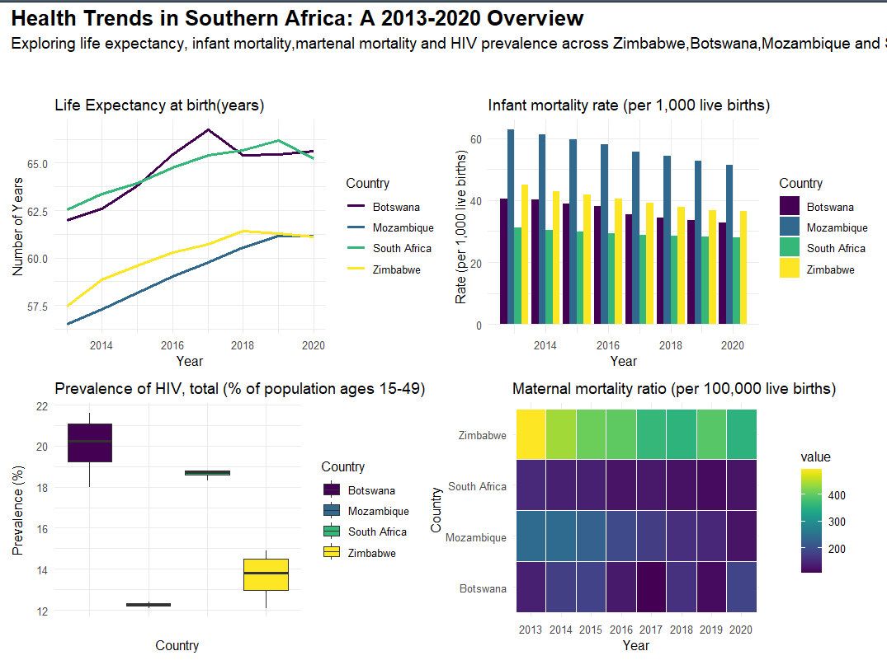

# Health Trends in Southern Africa: A 2013-2020 Overview  

This project visualizes key health indicators in Southern Africa between 2013 and 2020, leveraging data from the World Bank. The primary focus is on life expectancy, infant mortality rates, maternal mortality ratios, and HIV prevalence across selected countries: Zimbabwe, Botswana, Mozambique, and South Africa.  

## Data Source  
The dataset used in this analysis is obtained from the **World Bank API** (`API_Download_DS2_en_csv_v2_60220.csv`). For more details on the data, visit the [World Bank Data website](https://data.worldbank.org).  

## Libraries Used  
The following R libraries were utilized for data manipulation and visualization:  
- `ggplot2`: For creating rich and customizable visualizations.  
- `tidyr` and `dplyr`: For data wrangling and transformations.  
- `gridExtra`: To arrange multiple plots on a grid.  
- `reshape2`: For reshaping data for the heatmap.  
- `viridis`: For consistent, perceptually uniform color schemes.  
- `patchwork`: For arranging multiple plots into a cohesive visualization.  
- `ggtext`: To customize plot annotations and text styles.  

## Key Visualizations  
1. **Life Expectancy Line Chart**  
   - Plots the trend in life expectancy at birth for each country over the years 2013–2020.  

2. **Infant Mortality Rate Bar Chart**  
   - Displays the infant mortality rate (per 1,000 live births) for the selected countries.  

3. **HIV Prevalence Box Plot**  
   - Visualizes the distribution of HIV prevalence (% of the population aged 15-49) across the countries.  

4. **Maternal Mortality Ratio Heatmap**  
   - Shows the maternal mortality ratio (modeled estimate per 100,000 live births) for each country and year.  
## Visualization


## Usage  
1. **Install Required Libraries**  
   Ensure all the libraries mentioned in the "Libraries Used" section are installed in your R environment.  
   ```R
   install.packages(c("ggplot2", "tidyr", "dplyr", "gridExtra", "reshape2", "viridis", "patchwork", "ggtext"))

